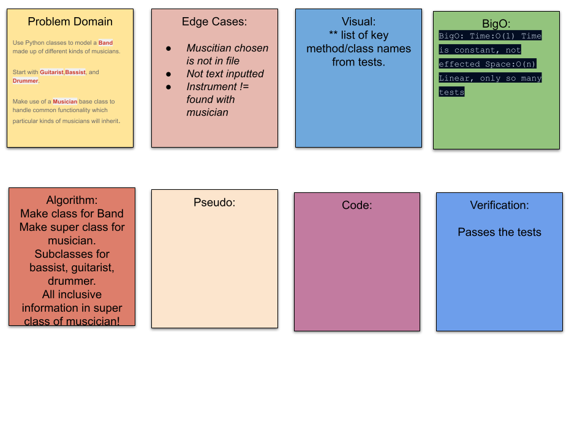

# README

## Making a garage band

Given a file of tests, make a .py file that makes the 17 garage band tests pass using subjects from class, about ;Python classes!

Challenge
Pass the Tests

Approach & Efficiency
BigO: Time:O(1) Time is constant, not effected Space:O(n) Linear, only so many tests

## Solution

Friendly reminder to always look through the given tests for key phrases, def, and names!

## Pythonic-Band Whiteboard Whiteboard

## Contributions:

[W3Schools](https://www.w3schools.com/python/python_classes.asp)

[All about super classes](https://www.pythonprogramming.in/how-to-use-super-with-a-class-method.html)

